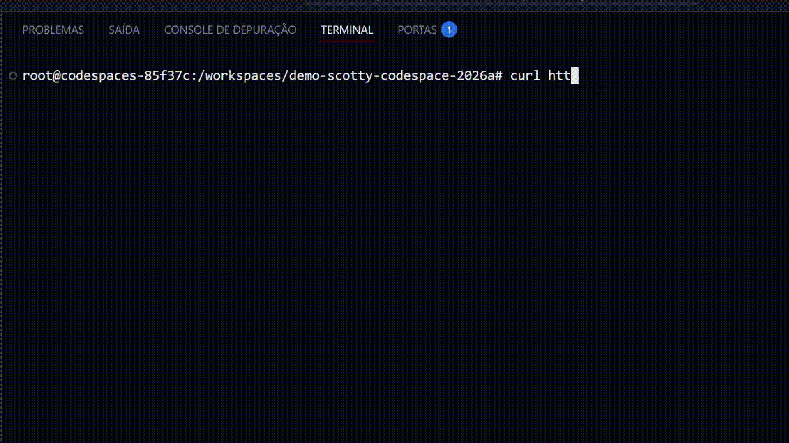

# apresentacao-bim1-2026a-Eduarda-araujo19
------------------------------------------------------------------------------------------------------------

# PARTE TEÓRICA:


### Elementos já conhecidos:

````let...in```` :

````haskell
calcDistance lat1 lon1 lat2 lon2 = 
    let r = 6371.0 -- Earth's radius in km
        dLat = (lat2 - lat1) * pi / 180.0
        dLon = (lon2 - lon1) * pi / 180.0
        a = sin (dLat / 2.0) * sin (dLat / 2.0) +
            cos (lat1 * pi / 180.0) * cos (lat2 * pi / 180.0) *
            sin (dLon / 2.0) * sin (dLon / 2.0)
        c = 2.0 * atan2 (sqrt a) (sqrt (1.0 - a))
    in r * c
````

Define nomes de variáveis ou funções que serão usadas dentro de uma expressão final.
Melhora a legibilidade do código e permite a quebra de expressões complexas em expressões simples.

<br>

````if then else```` : 
````haskell
get "/users/:id" $ do
      idParam <- pathParam "id" :: ActionM Int
      result  <- liftIO $ query conn "SELECT id, name, email FROM users WHERE id = ?" (Only idParam) :: ActionM [User]
      if null result
        then status status404 >> json ("User not found" :: String)
        else json (head result)
````
Expressão que retorna um valor booleano

<br>

### Elementos Novos:

````pack:````

````haskell
            response = poiListToJSONString near
        text (pack response)
````
Converte uma String para o tipo Text

<br>

````liftIO````
````haskell
main :: IO ()
main = scotty 3000 $ do
    middleware logStdoutDev
    get "/advice" $ do
        randomAdvice <- liftIO getRandomAdvice   
        text randomAdvice
````
Função que pega um tipo de dado (IO) e traz para dentro de um contexto(Scotty)

--------------------------------------------------------------------------------------------------------------------------
# PARTE PRÁTICA
--------------------------------------------------------------------------------------------------------------------------
### Descrição:
  A modificação feita foi a implementação de uma nova função que gera um número aleatório de 0 a 100.Além disso, foram
  adicionados textos para apresentar o resultado.
  
 ````haskell
  getRandomNumber :: IO Int
  getRandomNumber = do
      index <- randomRIO (0 , 100)
      return index
  
  main :: IO ()
  main = scotty 3000 $ do
      middleware logStdoutDev
      
      get "/advice" $ do
              randomAdvice <- liftIO getRandomAdvice
              randomNumber <- liftIO getRandomNumber
              text ("Conselho do dia:\n" <> randomAdvice <> "\nNúmero da sorte: " <> pack (show randomNumber) <> "\n")
````
````<>:```` Concatenação
<br>
````show:````Converte Int para String

### Resultado:

